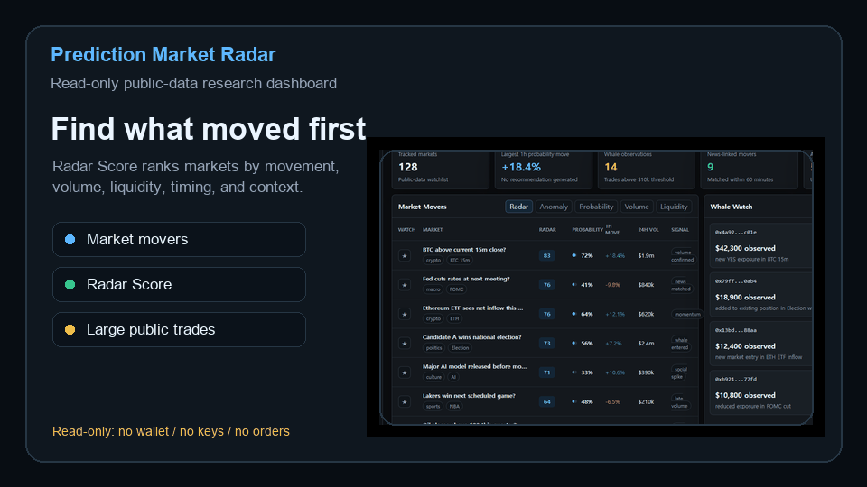
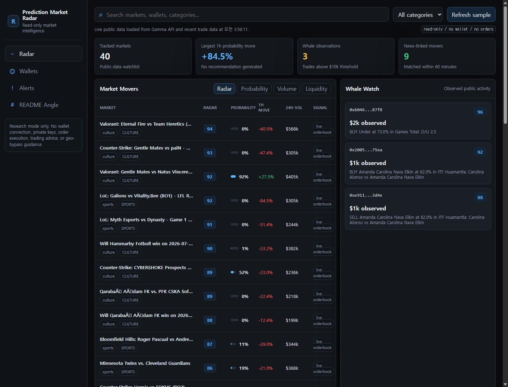
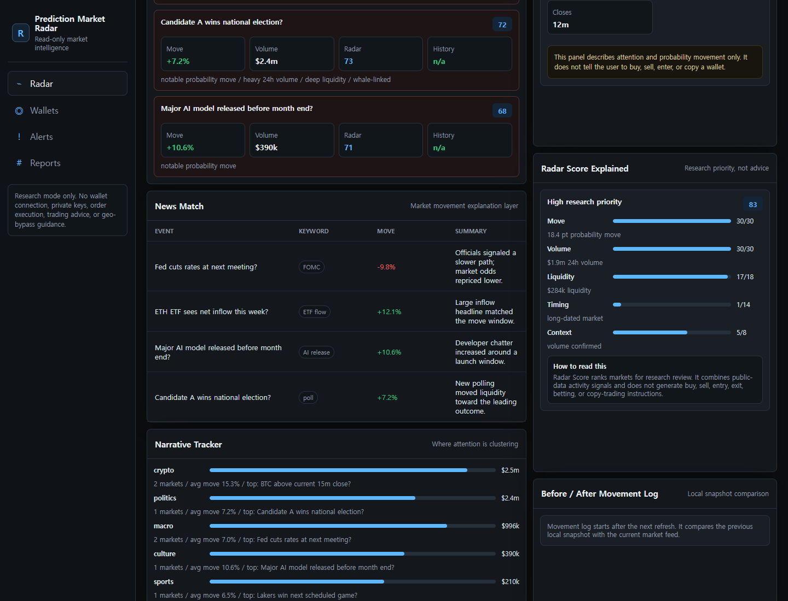
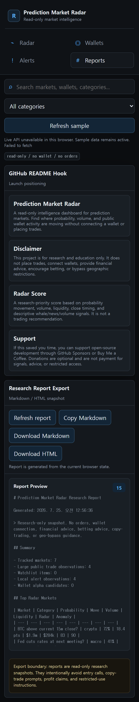

# Prediction Market Radar


A local radar for spotting unusual prediction-market moves before opening 20 tabs.

Prediction Market Radar turns public prediction-market data into one read-only local dashboard: movers, probability shifts, anomalies, large public trades, wallet research, local alerts, and exportable reports.

Use it when you want to quickly answer:

- Which markets moved the most?
- Which moves look unusual enough to review?
- Where are large public trades showing up?
- Which public wallets are worth studying?
- What changed since the last local snapshot?

It runs locally, requires no API key, and stays read-only: no wallet connection, no private keys, no order execution, and no trading or betting advice.

## Preview





Radar Score explanation:



## Why This Exists

Prediction-market research is scattered across market pages, trade feeds, wallet pages, notes, and exports.

Prediction Market Radar compresses that review loop into a small local dashboard:

| Research question | Where to look |
| --- | --- |
| What moved today? | Radar tab, sorted by Radar Score |
| What looks abnormal? | Anomaly Detector and movement history |
| Are large public trades appearing? | Whale Watch |
| Which wallets deserve more review? | Wallet scorecard and Wallet Alpha Ranking |
| Can I save the current view? | Reports tab for Markdown, HTML, and CSV exports |

> Research dashboard only. No wallet connection, no private keys, no order execution, no trading or betting advice.

## Links

| Resource | Link |
| --- | --- |
| Latest release | https://github.com/Havys96/prediction-market-radar/releases/tag/v0.1.0 |
| Demo checklist | `DEMO.md` |
| Community feedback drafts | `COMMUNITY_FEEDBACK.md` |
| New issue | https://github.com/Havys96/prediction-market-radar/issues/new/choose |
| Launch copy | `SOCIAL_POSTS.md`, `PUBLIC_LAUNCH_PACK.md`, `FIRST_POST.md`, and `LAUNCH.md` |
| Legal notice | `LEGAL.md` |
| Support guide | `FUNDING_GUIDE.md` |
| Sponsor setup | `SPONSORS_SETUP.md` |

## Try It In 60 Seconds

```bash
git clone https://github.com/Havys96/prediction-market-radar.git
cd prediction-market-radar
python smoke_test.py
python server.py
```

Open:

```text
http://127.0.0.1:8765
```

## Best For

- prediction-market researchers
- public-data analysts
- dashboard builders
- wallet-activity review
- local research workflows

Not for automated trading, automated betting, copy-trading, or financial advice.

## Demo Path

1. Open the Radar tab to review market movers, anomaly cards, narrative clusters, and the local watchlist.
2. Open the Wallets tab to inspect public wallet PnL, activity, and Wallet Alpha Ranking.
3. Open the Alerts tab to configure local descriptive observation rules.
4. Open the Reports tab to export the current research snapshot as Markdown, HTML, or CSV.

See `DEMO.md` for the full review checklist.

See `PRELAUNCH_REVIEW.md` before publishing the repo.

## Mobile Preview

Mobile reports view:



## Features

| Area | Included |
| --- | --- |
| Markets | active Polymarket markets, probability, volume, liquidity, explainable Radar Score |
| Anomalies | anomaly detector, 15m/1h/24h server-history deltas, before/after movement log |
| Narratives | category-level attention clusters and top market summaries |
| Watchlist | browser-stored watchlist and local daily digest |
| Public trades | recent large public trade observations |
| Wallets | public wallet positions, closed positions, activity, estimated PnL, win rate, risk grade |
| Wallet Alpha | public wallet activity scoring and candidate ranking |
| Alerts | local rules, local observation log, optional browser notifications |
| Reports | Markdown, HTML, and CSV research snapshot export |
| Operations | local Python proxy, JSON snapshot fallback, smoke test, GitHub Actions CI |

Requires no API key.

## What It Does Not Do

- No order execution
- No private key input
- No wallet connection
- No copy-trading
- No financial advice
- No betting advice
- No geographic restriction bypass
- No guaranteed-profit claims

## Quick Start

Requirements:

- Python 3.10+
- Internet connection

Run:

```bash
python smoke_test.py
python server.py
```

Open:

```text
http://127.0.0.1:8765
```

On Windows, you can also run:

```text
run.bat
```

Demo checklist:

```text
DEMO.md
```

## Optional Snapshot Cache

The app includes cached JSON files under `data/` so the dashboard can still load a recent snapshot if the local Python process cannot reach the public APIs.

To refresh the snapshot on Windows:

```powershell
.\update_snapshot.ps1
```

The snapshot contains:

- `data/markets.json`
- `data/leaderboard.json`
- `data/whales.json`

## Data Sources

Public endpoints used:

- `https://gamma-api.polymarket.com/markets`
- `https://data-api.polymarket.com/trades`
- `https://data-api.polymarket.com/positions`
- `https://data-api.polymarket.com/closed-positions`
- `https://data-api.polymarket.com/activity`

The local server only proxies read-only public data and validates wallet address format before forwarding wallet-analysis requests.

## Radar Score

Radar Score is a research-priority score from 0 to 100.

It combines:

- probability movement
- 24h volume
- liquidity
- time to market close
- descriptive indicators such as whale, news, or volume activity

The app shows the separate factor contribution for the selected market so the score is easier to inspect.

Radar Score is not a trading recommendation.

## Project Status

MVP:

- live market list
- public large-trade radar
- market anomaly detector
- narrative tracker
- local watchlist and daily digest
- 15m/1h/24h probability-change history
- before/after movement log
- server-side market history file
- wallet scorecard
- wallet alpha ranking
- recent activity table
- local descriptive alerts
- Markdown, HTML, and CSV research exports
- local snapshot fallback

Current version:

```text
v0.1.0
```

Planned:

- Telegram and Discord alerts
- demo GIF or short video

## Safety Boundary

This project is for research and education only.

It does not place trades, connect wallets, provide financial advice, encourage betting, or bypass geographic restrictions.

See `LEGAL.md` for the full legal and safety notice.

## Support

If this project saves you time, you can support open-source development through GitHub Sponsors, Buy Me a Coffee, or Ko-fi.

Donations are optional and are not payment for signals, investment advice, betting advice, trading access, or restricted functionality.

See `FUNDING_GUIDE.md` before adding any funding links. The safest default is GitHub Sponsors first, creator-support links second, and no public personal crypto wallet address at launch.

The repository funding file points to GitHub Sponsors for `Havys96`. See `SPONSORS_SETUP.md` to finish GitHub account onboarding if the Sponsor button is not visible yet.

## Suggested GitHub Topics

```text
polymarket
prediction-market
market-research
dashboard
wallet-analysis
whale-watcher
market-intelligence
alerts
open-source
```

## License

MIT
